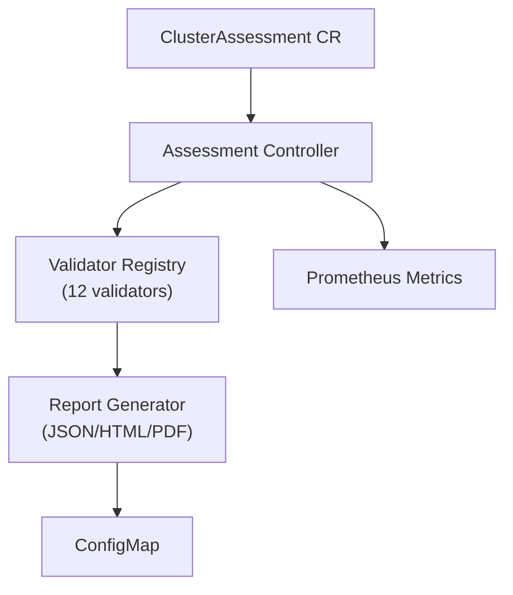

# OpenShift Cluster Assessment Operator

[](https://golang.org)
[](https://www.redhat.com/en/technologies/cloud-computing/openshift)
[](LICENSE)
[](bundle/)
[](docs/upgrade.md)

A Kubernetes Operator for Red Hat OpenShift that performs **read-only** assessments of cluster configuration and generates human-readable reports highlighting configuration gaps, unsupported settings, and improvement opportunities.

## 🎯 Overview

The Cluster Assessment Operator is designed for consulting engagements where customers need visibility into their OpenShift cluster's configuration health.

### Key Features

| Feature | Description |
|---------|-------------|
| 🔍 **Read-only** | No automatic remediation or configuration changes |
| 📊 **12 Validators** | Comprehensive checks across platform, security, networking, storage |
| 📄 **Multiple Formats** | JSON, HTML, and PDF report output |
| ⏰ **Scheduling** | On-demand or cron-based assessments |
| 📈 **Prometheus Metrics** | Export scores and findings for alerting |
| 🎚️ **Severity Filtering** | Focus on WARN/FAIL findings only |
| 🏷️ **Baseline Profiles** | Production (strict) vs Development (relaxed) |

---

## 📦 Quick Start

### 1. Install the Operator

```bash
# Clone and deploy
git clone https://github.com/diegobskt/cluster-assessment-operator.git
cd cluster-assessment-operator

# Install CRDs, namespace, RBAC, and manager (order matters!)
oc apply -f config/crd/bases/
oc apply -f config/manager/    # Creates namespace first
oc apply -f config/rbac/       # Requires namespace to exist
```

### 2. Run Your First Assessment

```bash
# Create a quick assessment
cat <<EOF | oc apply -f -
apiVersion: assessment.openshift.io/v1alpha1
kind: ClusterAssessment
metadata:
  name: my-assessment
spec:
  profile: production
  reportStorage:
    configMap:
      enabled: true
      format: "html"
EOF

# Watch progress
oc get clusterassessment my-assessment -w
```

### 3. View the Report

```bash
# Get findings summary
oc get clusterassessment my-assessment

# Extract HTML report
oc get configmap my-assessment-report -n openshift-cluster-assessment \
  -o jsonpath='{.data.report\.html}' > report.html
open report.html
```

---

## 🔍 Validators

| Validator | Category | What It Checks |
|-----------|----------|----------------|
| `version` | Platform | OpenShift version, upgrade channel, update availability |
| `nodes` | Infrastructure | Node count, conditions, roles, OS consistency |
| `machineconfig` | Platform | MachineConfigPool health, custom MachineConfigs |
| `apiserver` | Platform | API server status, etcd health, encryption, audit logging |
| `operators` | Platform | ClusterServiceVersion states, ClusterOperator health |
| `certificates` | Security | TLS certificate expiration, custom certs |
| `etcdbackup` | Platform | OADP, Velero, backup CronJob configuration |
| `security` | Security | Cluster-admin bindings, privileged pods, RBAC |
| `networking` | Networking | CNI type, NetworkPolicies, ingress configuration |
| `storage` | Storage | StorageClasses, default SC, CSI drivers |
| `monitoring` | Observability | Cluster monitoring, user workload monitoring |
| `deprecation` | Compatibility | Deprecated patterns, missing probes |

---

## 📋 ClusterAssessment Spec

```yaml
apiVersion: assessment.openshift.io/v1alpha1
kind: ClusterAssessment
metadata:
  name: example
spec:
  # Assessment profile: "production" (strict) or "development" (relaxed)
  profile: production
  
  # Optional: Cron schedule for recurring assessments
  schedule: "0 2 * * 0"  # Every Sunday at 2 AM
  
  # Optional: Minimum severity to include (INFO, PASS, WARN, FAIL)
  minSeverity: WARN
  
  # Optional: List of specific validators to run (empty = all)
  validators:
    - version
    - nodes
    - security
  
  # Report storage configuration
  reportStorage:
    configMap:
      enabled: true
      name: my-report        # Optional custom name
      format: "json,html,pdf"  # Formats to generate
```

---

## 📊 Baseline Profiles

| Setting | Production | Development |
|---------|------------|-------------|
| Min control plane nodes | 3 | 1 |
| Min worker nodes | 3 | 1 |
| Network policies required | Yes | No |
| Privileged containers | Blocked | Allowed |
| Max update age | 90 days | 180 days |

---

## 📈 Prometheus Metrics

The operator exposes metrics at `/metrics`:

```promql
# Overall assessment score (0-100)
cluster_assessment_score{assessment_name="my-assessment", profile="production"}

# Findings by status
cluster_assessment_findings_total{assessment_name="my-assessment", status="FAIL"}

# Findings by category
cluster_assessment_findings_by_category{category="Security", status="WARN"}

# Last run timestamp
cluster_assessment_last_run_timestamp{assessment_name="my-assessment"}

# Assessment duration
cluster_assessment_duration_seconds{assessment_name="my-assessment"}
```

**Example Alert:**
```yaml
- alert: ClusterAssessmentScoreLow
  expr: cluster_assessment_score < 70
  for: 1h
  labels:
    severity: warning
  annotations:
    summary: "Cluster assessment score is below 70%"
```

---

## 🛠️ Development

### Build Commands

| Command | Description |
|---------|-------------|
| `make build` | Build manager binary |
| `make test` | Run unit tests |
| `make test-coverage` | Run tests with coverage report |
| `make lint` | Run golangci-lint |

### Container Build Commands

| Command | Description |
|---------|-------------|
| `make podman-build` | Build container for **amd64** (OpenShift default) |
| `make podman-build-local` | Build container for local architecture |
| `make podman-push` | Push single-arch image |
| `make podman-buildx` | Build + push **multi-arch** manifest (amd64/arm64) |

### Run Locally

```bash
# Against a remote cluster
export KUBECONFIG=~/.kube/config
make run
```

---

## 📋 OLM / OperatorHub

This operator uses **File Based Catalog (FBC)** format following [OLM best practices](https://olm.operatorframework.io/docs/best-practices/).

### Channels

| Channel | Purpose | Users |
|---------|---------|-------|
| `stable-v1` | Production-ready, officially supported | Most users |
| `candidate-v1` | Pre-release, may become stable | Testing |
| `fast-v1` | Latest features, early access | Early adopters |

### Bundle Commands

| Command | Description |
|---------|-------------|
| `make bundle` | Generate OLM bundle manifests |
| `make bundle-build-local` | Build bundle for local architecture |
| `make bundle-buildx` | Build + push **multi-arch** bundle (amd64/arm64) |

### FBC Catalog Commands

| Command | Description |
|---------|-------------|
| `make catalog-validate` | Validate all FBC catalogs (v4.12-v4.20) |
| `make catalog-build-single OCP_VERSION=v4.14` | Build catalog for specific OCP version |
| `make catalog-build` | Build catalog images for all OCP versions |
| `make catalog-push` | Push all catalog images |
| `make scorecard` | Run OLM scorecard tests |
| `make preflight` | Run Red Hat Preflight checks |

### Deploy via OLM

**Option 1: Quick Deploy (Testing)**
```bash
make bundle-buildx
make deploy-olm

# To uninstall
make cleanup-olm
```

**Option 2: CatalogSource (Production)**

1. Build and push catalog:
```bash
make bundle-buildx
make catalog-build-single OCP_VERSION=v4.14
podman push ghcr.io/diegobskt/cluster-assessment-operator-catalog:v4.14
```

2. Create CatalogSource:
```yaml
apiVersion: operators.coreos.com/v1alpha1
kind: CatalogSource
metadata:
  name: cluster-assessment-catalog
  namespace: openshift-marketplace
spec:
  sourceType: grpc
  image: ghcr.io/diegobskt/cluster-assessment-operator-catalog:v4.14
  displayName: Cluster Assessment Operator
  publisher: Community
```

3. Create Subscription:
```yaml
apiVersion: operators.coreos.com/v1alpha1
kind: Subscription
metadata:
  name: cluster-assessment-operator
  namespace: openshift-operators
spec:
  channel: stable-v1
  name: cluster-assessment-operator
  source: cluster-assessment-catalog
  sourceNamespace: openshift-marketplace
```

4. Verify:
```bash
oc get csv -n openshift-operators | grep cluster-assessment
```

### Red Hat Certification Status

| Requirement | Status |
|-------------|--------|
| UBI base image | ✅ `ubi9/ubi-micro` |
| Required labels | ✅ All 7 labels |
| License directory | ✅ `/licenses/LICENSE` |
| Non-root execution | ✅ USER 65532 |
| Scorecard tests | ✅ All passing |
| Multi-arch | ✅ amd64 + arm64 |
| FBC catalogs | ✅ v4.12-v4.20 |

---

## 🏗️ Architecture



| Component | Purpose |
|-----------|---------|
| **ClusterAssessment CR** | Defines assessment parameters (profile, schedule, validators) |
| **Assessment Controller** | Reconciles resources, triggers validators, calculates scores |
| **Validator Registry** | Manages 12 validators across Platform, Security, Networking, Storage |
| **Report Generator** | Produces JSON, HTML, and PDF reports |
| **Prometheus Metrics** | Exports scores and findings for alerting |

📐 **See [Architecture Documentation](docs/architecture.md) for detailed diagrams** including:
- High-level architecture flowchart
- Component interaction sequence diagram
- Validator categories mindmap
- Assessment lifecycle state machine
- Data model ERD

---

## 🔒 Security

- **Read-only RBAC**: Only `get`, `list`, `watch` on cluster resources
- **UBI base image**: Red Hat Universal Base Image for certification
- **Non-root container**: Runs as USER 65532
- **No privilege escalation**: `allowPrivilegeEscalation: false`
- **Seccomp**: `RuntimeDefault` profile enabled

---

## 📚 Additional Documentation

| Document | Description |
|----------|-------------|
| [Architecture](docs/architecture.md) | Visual diagrams of operator components and workflows |
| [Troubleshooting](docs/troubleshooting.md) | Common issues and solutions |
| [Upgrade Guide](docs/upgrade.md) | Version upgrade procedures |
| [Contributing](CONTRIBUTING.md) | Guidelines for contributors |
| [Changelog](CHANGELOG.md) | Version history and changes |
| [Examples](examples/) | Sample ClusterAssessment resources |

---

## 🔄 CI/CD

This project uses GitHub Actions for automation:

| Workflow | Trigger | Description |
|----------|---------|-------------|
| **CI** | Push/PR to main | Lint, test, build, validate bundle & FBC catalogs |
| **Release** | Tag `v*` | Build multi-arch images, catalog images (v4.12-v4.20), create release |
| **FBC Auto-Update** | Tag `v*` | Update FBC catalogs and create PR |
| **Scorecard** | Bundle changes | OLM scorecard and bundle validation |
| **Dependabot** | Weekly | Automated dependency updates |

### Creating a Release

```bash
# Update CHANGELOG.md
git tag v1.1.0
git push origin v1.1.0
```

This triggers:
1. Builds multi-arch operator + bundle images
2. Builds catalog images for OCP v4.12-v4.20
3. Creates GitHub Release with install.yaml
4. Creates PR to update FBC catalogs

---

## 🤝 Contributing

We welcome contributions! See [CONTRIBUTING.md](CONTRIBUTING.md) for detailed guidelines.

**Quick start:**
1. Fork the repository
2. Create a feature branch: `git checkout -b feature/my-feature`
3. Make changes and add tests
4. Run checks: `make test && make lint`
5. Commit using [Conventional Commits](https://www.conventionalcommits.org/)
6. Submit a pull request

---

## 📄 License

[Apache License 2.0](LICENSE)